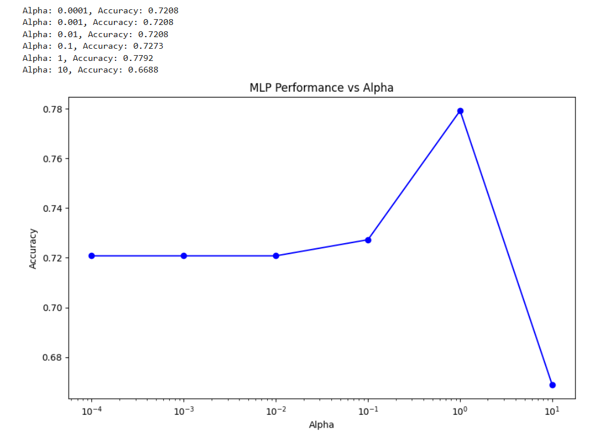
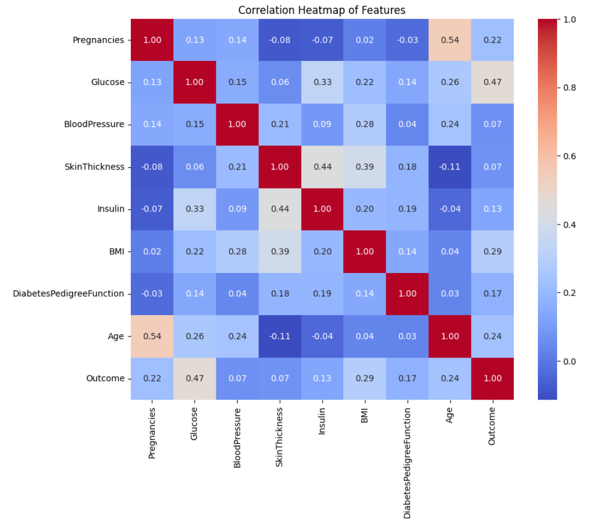

# Diabetes Classification using Machine Learning

## Project Overview

This project investigates the use of supervised machine learning techniques to predict diabetes using the **Pima Indians Diabetes Dataset**. Multiple classification algorithms were implemented, evaluated, and compared to identify the most effective model for predicting diabetes outcomes.

The project also explores feature engineering and dimensionality reduction techniques to improve model performance and interpretability.

---

## Objectives

- Predict diabetes using supervised machine learning algorithms.
- Compare the performance of different classification models.
- Evaluate model performance using standard classification metrics.
- Compare model training times.
- Apply dimensionality reduction techniques.
- Perform feature selection to identify the most important predictors.

---

## Dataset

**Dataset:** Pima Indians Diabetes Dataset

The dataset contains medical information collected from female patients of Pima Indian heritage.

- Number of records: **768**
- Number of features: **8**
- Target variable: **Outcome**
  - 0 = Non-diabetic
  - 1 = Diabetic

Features include:

- Pregnancies
- Glucose
- Blood Pressure
- Skin Thickness
- Insulin
- BMI
- Diabetes Pedigree Function
- Age

---

## Technologies Used

- Python
- Pandas
- NumPy
- Scikit-learn
- Matplotlib
- Seaborn
- Google Colab

---

## Machine Learning Algorithms

The following supervised learning algorithms were implemented:

- Multi-Layer Perceptron (MLP)
- Support Vector Machine (SVM)
- Logistic Regression

---

## Data Preprocessing

The following preprocessing steps were performed before training the models:

- Loaded dataset using Pandas
- Separated features and target variable
- Split data into training and testing sets
- Standardized features using StandardScaler

---

## Experiments Performed

### 1. Multi-Layer Perceptron Solver Comparison

Compared different optimization solvers:

- Adam
- SGD
- LBFGS

Evaluation included:

- Accuracy
- Precision
- Recall
- F1-score
- Training Time

---

### 2. Hyperparameter Analysis

Investigated the impact of different alpha values on MLP performance.

Alpha values tested:

- 0.0001
- 0.001
- 0.01
- 0.1
- 1
- 10

Performance was visualized using an accuracy vs alpha plot.
#### Accuracy vs Alpha



---

### 3. Training Time Comparison

Compared computational efficiency of:

- Support Vector Machine
- Logistic Regression

Training times were measured and analyzed.

---

### 4. Correlation Analysis

Generated a correlation heatmap to examine relationships between predictor variables and identify feature dependencies.
#### Correlation Heatmap



---

### 5. Principal Component Analysis (PCA)

Applied PCA for dimensionality reduction.

The transformed data was used to train a Logistic Regression model and evaluate its classification performance.

---

### 6. Linear Discriminant Analysis (LDA)

Applied Linear Discriminant Analysis (LDA) to reduce dimensionality while preserving class separability.

Performance was evaluated using Logistic Regression.

---

### 7. Feature Selection

Implemented two feature selection techniques:

#### Recursive Feature Elimination (RFE)

- Selected the five most important features
- Evaluated Logistic Regression using selected features

#### SelectKBest

- Selected top five statistically significant features
- Compared model performance

---

### 8. Model Comparison

Compared the following classifiers:

- Multi-Layer Perceptron
- Support Vector Machine
- Logistic Regression

Evaluation metrics:

- Accuracy
- Precision
- Recall
- F1-score

---

## Results

The project demonstrated how different machine learning algorithms perform on the same classification problem.

Key observations include:

- Logistic Regression provided a strong baseline with fast training time.
- MLP performance varied depending on the optimization solver and alpha parameter.
- SVM achieved competitive classification performance.
- PCA and LDA successfully reduced dimensionality while maintaining predictive capability.
- Feature selection reduced model complexity while retaining important predictive information.

---

## Project Workflow

Dataset

↓

Data Preprocessing

↓

Train-Test Split

↓

Feature Scaling

↓

Model Training

- MLP
- SVM
- Logistic Regression

↓

Hyperparameter Analysis

↓

Dimensionality Reduction

- PCA
- LDA

↓

Feature Selection

- RFE
- SelectKBest

↓

Model Evaluation

↓

Performance Comparison

---

## Project Structure

```
diabetes-classification-analysis/

│── diabetes_classification.ipynb
│── README.md
│── requirements.txt
│
├── data/
│   └── diabetes.csv
│
├── images/
│   ├── correlation_heatmap.png
│   ├── alpha_vs_accuracy.png
│
└── results/
```

---

## How to Run

1. Clone the repository.

```
git clone https://github.com/yourusername/diabetes-classification-analysis.git
```

2. Install required libraries.

```
pip install -r requirements.txt
```

3. Open the notebook.

```
jupyter notebook diabetes_classification.ipynb
```

or

Open the notebook using Google Colab.

4. Run all cells.

---

## Future Improvements

Possible future enhancements include:

- Hyperparameter tuning using GridSearchCV
- Cross-validation
- Random Forest Classifier
- XGBoost
- LightGBM
- Deep Neural Networks
- Explainable AI using SHAP
- Model deployment using Streamlit or Flask

---

## Learning Outcomes

Through this project I gained practical experience in:

- Machine Learning Classification
- Data Preprocessing
- Feature Engineering
- Hyperparameter Tuning
- Model Evaluation
- Dimensionality Reduction
- Feature Selection
- Data Visualization
- Python for Machine Learning

---

## Author

**Abhiram S**

Master of Information Science (Distinction)  
Massey University, New Zealand


---
